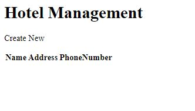

# AsyncInn
We have been asked to create a Hotel Management system. By the end we will be able to add, delete, and edit hotels, rooms, amenities, etc

## Features
We have 5 classes that interct with each other.
- Hotel, which is like the hotel building
	- Contains information on the name, address and phone number of the hotel.
- Hotel Room, which rooms the Hotels have
	- Contains information on the which Hotel, the specific room number, the room type, room rate, and if it is pet friendly.
- Room, are the different room types
	- Contains information like the room name (like a nickname like the honeymoon suite) and the layout of the room (like it is a one bedroom)
- Room Amenities, provides the abilities to identify which rooms have which amenities
	- Contains the room type and which amenities it has
- Amenities, which will be a list of the possible amenities
	- Contains the names of the different amenities

One Hotel can have many HotelRooms, which a HotelRoom can only have one Room type, and Rooms can have many Amenities.
HotelRoom and RoomAmenities utilize Composite Keys, otherwise the rest use Primary Keys.

## Installing / Getting started
As a user you will not need to install anything to use it.
However as a developer, you will need Visual Studio with ASP.net Core 2.2 capabilities
The design is still in construction, but for now the home page looks like this:

and all the other pages have not been CSS'd yet

## Contributors

CSS Reset from: https://meyerweb.com/eric/tools/css/reset/

## Contributing

If you'd like to contribute, please fork the repository and use a feature
branch. Pull requests are warmly welcome.

## Licensing

The code in this project is licensed under MIT license.
