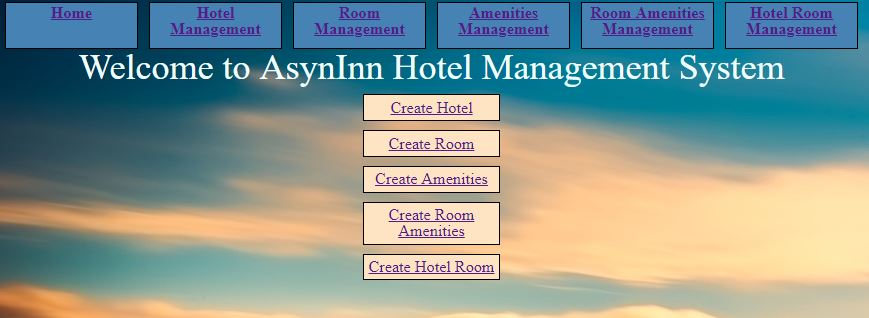

# AsyncInn
We have been asked to create a Hotel Management system. By the end we will be able to add, delete, and edit hotels, rooms, amenities, room amenities, and hotel rooms.
Deployed site:  https://jlyasyncinnapp.azurewebsites.net/

## Features
We have 5 classes that interct with each other.
- Hotel, which is like the hotel building
	- Contains information on the name, address and phone number of the hotel.
- Hotel Room, which rooms the Hotels have
	- Contains information on the which Hotel, the specific room number, the room type, room rate, and if it is pet friendly.
- Room, are the different room types
	- Contains information like the room name (like a nickname like the honeymoon suite) and the layout of the room (like it is a one bedroom)
- Room Amenities, provides the abilities to identify which rooms have which amenities
	- Contains the room type and which amenities it has
- Amenities, which will be a list of the possible amenities
	- Contains the names of the different amenities

One Hotel can have many HotelRooms, which a HotelRoom can only have one Room type, and Rooms can have many Amenities.
HotelRoom and RoomAmenities utilize Composite Keys, otherwise the rest use Primary Keys.
Database Schema provided from Amanda Iverson: 

## Installing / Getting started
As a user you will not need to install anything to use it.
However as a developer, you will need Visual Studio with ASP.net Core 2.2 capabilities
We utilized LINQ queries for scope for what renders to the HTML pages, as well as We utilized TagHeplpers
Currently this database comes seeded with:
- 5 default Hotel Locations
- 6 Room Types
- 5 Amenities

The home page looks like this:

The other pages look similar to the home page.

## Development
where i will comment about DI

## Versions
1. Created simple MVC application with 6 tables for models (noted above in the features). Set up the database Context connection for a local database. Set up the composit keys. Set up the view pages with minimal CSS. 
2. Added data annotation, seeded data, updated the dropdown lists to display names instead of IDs, and added more CSS.
3. Added a "layout" view all pages could utilize. Added a search box on the "home" pages of Hotel, Amenities, and Rooms. As well as the "home" pages for Hotel, Amenity and Rooms lists all the hotels/amenities/rooms/hotelrooms/room amenities "available" In addition to the Hotel's page one can see how many rooms each hotel has, and how many amenties a room has. 
4. Finally we deployed this to azure (https://jlyasyncinnapp.azurewebsites.net/), added unit testing, and applied CSS to all pages. 

## Contributors

CSS Reset from: https://meyerweb.com/eric/tools/css/reset/
Images from Pixabay
Image resizer: https://www.photoresizer.com/ 
A lot of code guidance from Amanda Iverson

## Contributing

If you'd like to contribute, please fork the repository and use a feature
branch. Pull requests are warmly welcome.

## Licensing

The code in this project is licensed under MIT license.
